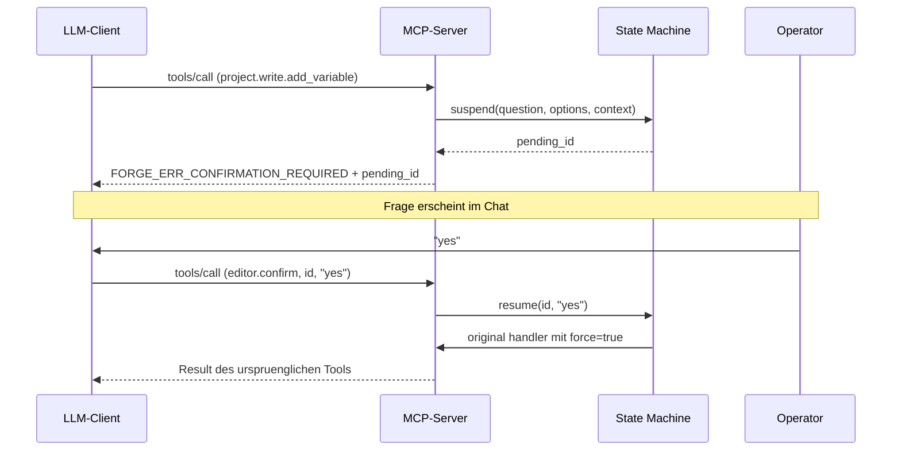

## Spezifikation

Quelldokument: `documentation/architecture/mcp-platform-v1.md` im
Source-Tree. Verbindlichkeit nach RFC 2119 (`MUST` / `SHOULD` /
`MAY`). Version: `v1`. Umfang: ~2300 LOC.

Die Implementierung referenziert die Spec-Abschnitte
(z.B. `§7.4.2` fuer das Caretaker-Modell). Aenderungen an der Spec
durchlaufen denselben Review-Prozess wie Code.

---

## Protokoll

| Feld | Wert |
|---|---|
| Protokoll | Model Context Protocol (MCP) |
| Version | 2025-03-26 |
| Transport | HTTP + Server-Sent Events |
| Wire-Format | JSON-RPC 2.0 |
| Lifecycle | `initialize` → `tools/list` → `tools/call` |
| Capabilities | `tools.listChanged: true` |
| `notifications/tools/list_changed` | nicht implementiert (Backlog) |
| Konformitaets-Test | mcp-inspector |

---

## Transport-Sicherheit

### TLS

| Feld | Wert |
|---|---|
| Stack | Qt6 QSslSocket + System-OpenSSL |
| Versionen | TLS 1.3, 1.2 |
| Server-Cert | RSA-4096, SAN-bound, 10 Jahre |
| Cert-Regenerierung | bei Bind-Adress-Aenderung |
| SAN-Validierung | RFC 6125 |
| Cipher-Suites | OpenSSL-Defaults (Distribution-gehaertet) |
| Selbst-implementierte Krypto | keine |

### mTLS (optional)

Aktiv sobald `~/.config/ForgeIEC/mcp/trust/*.pem` mind. ein CA-Cert
enthaelt.

| Feld | Wert |
|---|---|
| peerVerifyMode | QueryPeer |
| Fallback ohne Client-Cert | Bearer-Auth |
| Chain-Validation | Qt-SSL-Stack |
| Subject-Pruefung | gegen peers.toml (eigene Implementierung) |

---

## Federation-Roster

### Datei-Layout

```toml
# peers.toml
[meta]
sequence_number = 17
signed_ts = "2026-05-12T18:00:00Z"
signed_by = "ForgeIEC-Team-CA"
ca_fingerprint_sha256 = "ba:fc:ef:..."
signature_b64 = "..."

[[peer]]
name = "alice@team"
fingerprint_sha256 = "ab:cd:..."
role = "author"
endpoint = "https://alice-ws.factory:7531"
```

Analog `revoked.toml` fuer Revocation-Liste.

### Signatur

| Feld | Wert |
|---|---|
| Algorithmus | Ed25519 (bevorzugt) oder RSA-PSS-SHA256 |
| Implementierung | openssl pkeyutl shell-out |
| Signatur-Payload | Datei ohne `signature_b64`-Zeile (line-orientiert) |
| Replay-Schutz | monotone `sequence_number`, persistiert in QSettings |
| Verteilungs-Kanal | beliebig (Git, S3, HTTP, USB) |

### Code-Pfad

`FMcpPeerRoster::verifySignature` (Editor),
`FMcpCaretaker::signCsr` fuer Signing-Inverse. Reload via
QFileSystemWatcher mit 200 ms Debounce.

---

## Confirmation State Machine

Quelldatei: `FConfirmationStateMachine`. Spec: §9.5.

### Ablauf



### Eigenschaften

| Feld | Wert |
|---|---|
| Pending-ID | UUIDv4 |
| Timeout | 5 min Default, pro-Tool override |
| Bypass | nur via `force=true`, gesetzt durch State Machine selbst |
| Audit | append-only JSONL in `~/.config/ForgeIEC/mcp_audit.log` |
| Read-API | `editor.pending_confirmations` |

---

## Write-Zugriff: drei Pruefungen

### Pruefung 1 — Build-Time

```cmake
option(MCP_OVERRIDE_SECURITIES "Unlock MCP write tools" OFF)
```

Default OFF. Preprocessor-konditional — disabled Code-Pfade sind im
Default-Binary **nicht enthalten**. Kein Runtime-Switch.

### Pruefung 2 — State Machine

Jedes schreibende Tool durch §9.5 (siehe oben).

### Pruefung 3 — Sichtbarkeit

| Kanal | Inhalt |
|---|---|
| Chat-Verlauf | jeder Tool-Call sichtbar |
| `~/.config/ForgeIEC/mcp_audit.log` | JSONL, append-only, Timestamp + Tool + Args + Choice |
| `initialize.instructions` | Security-Override-Banner wenn Build-Time-Flag aktiv |
| `warnings[]` in Responses | Override-Banner wiederholt |

---

## Force-Pfad

Force-Setzungen (Wert-Pinning unabhaengig vom Programm) sind
**nicht** ueber MCP zugaenglich — kein `force.*`-Tool weder im
Default- noch im Override-Build.

### Defense-Layer

| Layer | Mechanismus |
|---|---|
| 1 — Codegen-TOML | `-DFORCING_ENABLED` cmake-Option der PLC-Runtime |
| 2 — anvild RPC | ForceVariable-Endpoint prueft PLC-Build-Mode |
| 3 — Editor-UI | F-Checkbox greyout wenn PLC-Build kein Force |
| 4 — MCP | kein Tool registriert |

MCP-Read-Side: `monitor.snapshot` liefert `forced=true|false` pro
Variable (Anvil-gRPC `is_forced`-Feld).

---

## Human-Identification

Quellklasse: `FMcpFingerprintArt`. Spec: §7.6.

### Memorable-ID

| Feld | Wert |
|---|---|
| Eingang | SHA-256-Fingerprint (32 Byte) |
| Bit-Slice | erste 44 Bit, geslicet in 4 × 11 Bit |
| Wordlist | BIP-39 English (2048 Eintraege) |
| Format | `word-word-word-word` |
| Bit-Flip-Sensitivitaet (erste 44 Bit) | 4/4 Wortwechsel |

### Randomart

| Feld | Wert |
|---|---|
| Algorithmus | OpenSSH drunken-bishop (`ssh-keygen -lv -E sha256`) |
| Grid | 17 × 9 |
| Augmentation-String | `" .o+=*BOX@%&#/^SE"` |
| Marker | S = Start, E = Bishop-Endposition |

### Surfaced in

| Endpunkt | Inhalt |
|---|---|
| `server_info.trust_store_cas[]` | pro Trust-Store-CA |
| `team.list_peers` | pro Peer |
| `team.request_cert` | fuer frisch ausgestellten Cert |

---

## Caretaker-Modell

Quellklasse: `FMcpCaretaker`. Spec: §7.4.

### Datei-Layout

```
~/.config/ForgeIEC/mcp/ca-team/
  ca.key   RSA-4096, 600-permissions
  ca.crt   X.509, CA:TRUE, 10 Jahre
                keyCertSign + cRLSign + digitalSignature
```

### Aktivierung

| Voraussetzung | Form |
|---|---|
| Build-Time | `MCP_OVERRIDE_SECURITIES=ON` |
| Runtime-Flag | QSettings `mcp/caretaker_enabled` |
| Modal-Bestaetigung | literal "I accept Team-CA responsibility" |
| Datei-Existenz | ca.key + ca.crt parse-valid |

`FMcpCaretaker::isCaretaker()` returnt true nur wenn alle 4
erfuellt.

### Operationen

| Tool | Status |
|---|---|
| `team.list_peers` (Member + Caretaker) | done |
| `team.request_cert` (Caretaker) | done |
| `team.revoke_peer` (Caretaker) | Stub (revoked.toml-Mutation Backlog) |
| `team.rotate_cert` (Member) | Backlog |
| `team.export_setup` (Caretaker) | Backlog |

Alle Mutationen via State Machine.

### Multi-Caretaker (HA)

Mehrere Caretakers moeglich. Konflikt-Resolution per monotoner
`sequence_number` im signierten Roster.

---

## Audit + Reproducibility

| Aspekt | Stand |
|---|---|
| Audit-Log | append-only JSONL, kein delete-Pfad |
| Audit-Felder | timestamp, tool, args, choice, called_by |
| Codegen-Determinismus | byte-identisches POUS.c pro `.forge` |
| Test-Coverage | 117+ Tests, IEC-Sprache + 132 Lib-Bausteine + Multi-Task + Persist + Force |
| Jitter-Test | physikalische Messung gegen Baseline |

---

## Implementierungs-Sprachen

### Editor

C++17 + Qt6. RAII via QObject-Parent-Chain. Implicit-shared
QObjects fuer Cross-Thread-Snapshots. Keine globalen mutablen
Zustaende.

Module der MCP-Schicht:

| Klasse | Datei |
|---|---|
| FMcpServer | editor/src/runtime/FMcpServer.cpp |
| FMcpCertManager | editor/src/runtime/FMcpCertManager.cpp |
| FMcpTrustStore | editor/src/runtime/FMcpTrustStore.cpp |
| FMcpPeerRoster | editor/src/runtime/FMcpPeerRoster.cpp |
| FMcpCaretaker | editor/src/runtime/FMcpCaretaker.cpp |
| FMcpFingerprintArt | editor/src/runtime/FMcpFingerprintArt.cpp |
| FConfirmationStateMachine | editor/src/runtime/FConfirmationStateMachine.cpp |
| FMcpAuditLog | editor/src/runtime/FMcpAuditLog.cpp |

### Runtime-Server

`anvild`: Rust + Tokio + tonic. Memory-sicher per Borrow-Checker.
gRPC-Proto: `anvil-server/proto/plc_service.proto`.

### IPC

Anvil (Rust + C-FFI). ABI-Probe gegen Type-Hash-Drift:
`anvil-shared@50cb29f`. Drei Defense-Layer gegen mismatched
Versionen.

---

## Standards

| Standard | Verwendung |
|---|---|
| IEC 61131-3 | Programmiersprache + Compile-Path (matiec) |
| PLCopen XML | Projekt-Dateiformat |
| RFC 6125 | TLS-Server-Cert SAN-Validation |
| RFC 8032 (Ed25519) | Roster-Signatur (bevorzugt) |
| RFC 8017 (RSA-PSS) | Roster-Signatur (HW-Token-Interop) |
| BIP-39 (English) | Memorable-ID Wordlist |
| SSH ssh-keygen | Randomart-Algorithmus |
| MCP 2025-03-26 | Protokoll |
| JSON-RPC 2.0 | Wire-Format |
| RFC 2119 | Spec-Verbindlichkeits-Sprache |
| TOML 1.0 | Konfiguration |

---

## Offene Punkte (Stand 2026-05-12)

| Item | Status |
|---|---|
| `team.revoke_peer` Voll-Implementierung | Stub |
| `team.rotate_cert` | Backlog |
| `team.export_setup` | Backlog |
| OCSP / CRL handling | nicht implementiert |
| Memorable-ID-Typing-Confirmation (§7.4.2) | derzeit yes/cancel |
| `notifications/tools/list_changed` SSE | nicht emittiert |
| Hardware-Token (PKCS#11 / FIDO2) fuer CA-Key | Roadmap |
| `force.*` Tool-Familie | Phase-3 Backlog |
| Bulk-Mode (MCP-10) | Backlog |
| Caretaker-Toggle-UI in Preferences | Backlog |

Vollstaendige Liste: `project_open_backlog.md` (intern).

---

## Lizenz

AGPL-3.0-or-later fuer alle Subprojekte. Source auf Anfrage
einsehbar — die Forgejo-Repositories sind nicht oeffentlich
zugaenglich, Zugriff nach Freischaltung des SSH-Public-Keys.
Reproducible-Build via CPack — signiertes APT-Repository fuer
Debian/Ubuntu, signiertes RPM-Repository fuer AlmaLinux 9 und
Fedora 44.

---

## Kontakt

Security-Reports + Audit-Anfragen: blacksmith@forgeiec.io —
verantwortliche Offenlegung bevorzugt.

---

## Weiter

- [Sicherheits-Modell (Anwender-Sicht)](/help/ai/security/)
- [Team-Mode](/help/ai/team/)
- [MCP-Protokoll fuer Programmierer](/help/mcp/programmers/)
- [MCP fuer IT-Betrieb](/help/mcp/it/)
- [Zurueck zur AI-Uebersicht](/help/ai/)
