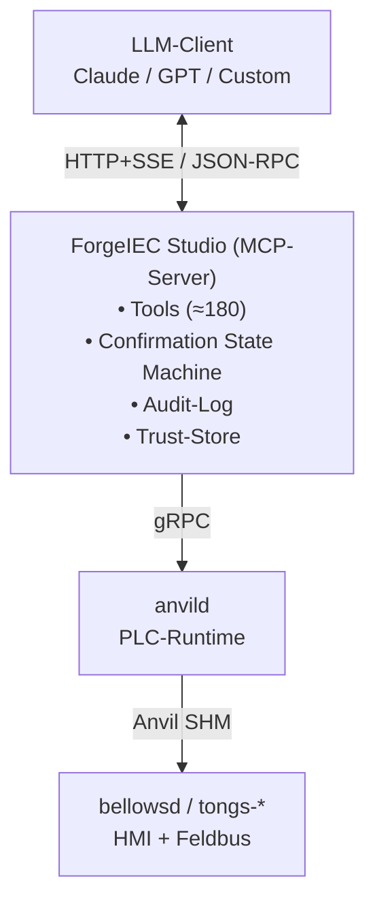

## Was ist MCP?

**MCP** steht fuer **Model Context Protocol**. Es ist ein **offenes,
herstellerunabhaengiges Protokoll** das Anthropic Anfang 2025
veroeffentlicht hat. Ziel: LLMs (Claude, ChatGPT, andere) sprechen
mit Werkzeugen wie Editoren, Datenbanken, Browser-Automaten — in
einer **einheitlichen, gut spezifizierten Sprache** statt jedes Mal
eine eigene Integration zu basteln.

ForgeIEC implementiert die **Server-Seite** von MCP — ForgeIEC
Studio **ist** ein MCP-Server. Jeder MCP-kompatible Client kann
sich verbinden — die wichtigsten Optionen:

- **Eingebauter Chat-Reiter in ForgeIEC Studio** selbst (Default,
  kein Setup)
- **Anthropic Claude Desktop** (Mac, Windows, Linux) — `~/Library/
  Application Support/Claude/claude_desktop_config.json` bzw. das
  Equivalent unter `~/.config/Claude/`; URL + Bearer-Token aus
  ForgeIEC Studio dort eintragen
- **VS Code** mit der **MCP-Extension** (z.B. „MCP" von
  Anthropic) — in den Extension-Settings den ForgeIEC-MCP-Server
  als externen MCP-Endpoint registrieren; danach koennen Sie aus
  VS Code-Chat-Sitzungen ForgeIEC-Tools aufrufen
- **Claude Code (CLI)** — `claude mcp add forgeiec
  https://forgeiec-ws.local:7531 --token <bearer>`
- **ChatGPT (OpenAI)** mit MCP-Connector
- **Custom-Clients** die Sie selbst schreiben (siehe naechster
  Abschnitt)
- **mcp-inspector** (das offizielle Debug-Tool, npm)

In allen Faellen brauchen Sie zwei Angaben aus ForgeIEC Studio:
**Server-URL** (`https://<hostname>:7531`) und **Bearer-Token**
aus `Preferences → AI → Profile → Bearer Token`. Damit kann
Ihr externer Client genau die gleichen MCP-Tools ausfuehren wie
der eingebaute Chat-Reiter.

---

## Fuer wen ist welche Seite hier?

Je nach Ihrer Rolle gibt es **zwei Einstiege**:

### [Fuer Applikationsingenieure](/help/mcp/programmers/)

Wer den MCP-Server von ForgeIEC Studio aus eigenen Skripten oder
Werkzeugen aufrufen will. Inhalte:

- Wie der Aufruf abläuft (Lifecycle)
- Authentifizierung mit Bearer-Token oder Client-Zertifikat
- Tool-Liste lesen + verstehen
- Beispiele mit `curl`
- Bestaetigungs-Rueckfragen abhandeln
- Stand der Plug-in-API

### [Fuer IT + Betrieb](/help/mcp/it/)

Wenn Sie ForgeIEC **deployen, ueberwachen oder integrieren** in eine
bestehende IT-Landschaft. Inhalte:

- Netzwerk: Ports, Firewall-Regeln, Bind-Adresse
- Zertifikate: Server-Cert, Trust-Store, Erneuerung
- Identitaeten + Tokens: Bearer pro Profil
- Log-Dateien: wo, welches Format, Rotation
- Backup: was sichern, was ist regenerierbar
- Monitoring: server_info als Health-Check fuer Ihr Monitoring-System
- Troubleshooting: haeufige Probleme + Recipes

---

## Architektur-Bild

Der MCP-Server ist **in den ForgeIEC-Studio-Prozess eingebaut** —
er teilt sich Speicher und Lifecycle mit dem laufenden Projekt. Tool-Aufrufe sind
deshalb extrem schnell (kein RPC-Hop), und der Client sieht immer
den **aktuellen In-Memory-Zustand**, nicht eine veraltete Datei-
Spiegelung.

---

## Spec-Verweise

Wenn Sie tiefer einsteigen wollen:

- **MCP-Protokoll selbst** (offiziell):
  `https://modelcontextprotocol.io`
- **MCP-Inspector** (Debug-Tool, npm):
  `https://github.com/modelcontextprotocol/inspector`
- **ForgeIEC's eigene MCP-Spec**: im Source-Tree unter
  `documentation/architecture/mcp-platform-v1.md` — RFC-2119-
  normativ, ca. 2300 LOC, deckt alle Sicherheits- und Federation-
  Entscheidungen ab

---

## Weiter

- [Fuer Programmierer + Integratoren](/help/mcp/programmers/)
- [Fuer IT + Betrieb](/help/mcp/it/)
- [Anwender-Sicht auf die KI-Schicht](/help/ai/)
- [Architektur-Tiefe](/help/ai/architecture/)
