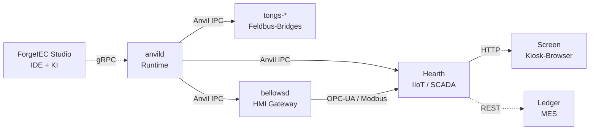

## Was die Plattform leistet

ForgeIEC ist eine vollstaendige Plattform fuer industrielle
Automatisierung — von der Programmierung bis zum Leitsystem. Jede
Komponente traegt den Namen eines Schmiedewerkzeugs und hat einen
klar umrissenen Auftrag. Komponenten sind eigenstaendige Daemonen
bzw. Anwendungen, gemeinsam laufen sie ueber Zero-Copy-IPC und
gRPC.

| | Komponente | Auftrag | Stand |
|:---:|---|---|---|
|    | **ForgeIEC Studio** | IEC-61131-3-IDE + Bus-Konfig + KI-Helfer | produktiv |
|    | **anvild**          | PLC-Runtime + Anvil-Zero-Copy-IPC zwischen Subsystemen | produktiv |
|  | **bellowsd**        | OPC-UA / HMI-Gateway | in Arbeit |
|     | **tongs-***         | Feldbus-Bridges (Modbus / EtherCAT / Profibus / EthernetIP) | gemischt |
|    | **Screen**          | Industrieller Kiosk-Browser (Bedienpanel) | produktiv |
|    | **Hearth**          | IIoT-Subscriber / SCADA-Schicht | in Arbeit |
|    | **Ledger**          | Auftragsverwaltung / MES-Integration | in Planung |

---

## Die Komponenten

### 🛠️ ForgeIEC Studio — die Werkbank



Native C++/Qt6-IDE auf der Workstation. Alle fuenf IEC-Sprachen
(ST + IL + FBD + LD + SFC), Bus-Konfiguration, Live-Monitor,
Oszilloskop, KI-Helfer eingebaut. Tree-sitter-basierte Syntax,
gRPC-Anbindung an anvild, MCP-Server fuer LLM-Tooling.

[Mehr erfahren](forge-studio/)

### 🔥 anvild — die Runtime + Anvil-IPC



Rust/Tokio-Daemon auf der Ziel-SPS. Multi-Task-Scheduler mit
pthread-Parallelitaet, deterministische Scan-Cycles, gRPC-Listener
fuer das Studio, Subprozess-Manager fuer die Bus-Bridges.

Eingebaut ist **Anvil** — die Zero-Copy-Shared-Memory-Schicht
zwischen Runtime, Bridges und externen Subscribern. ABI-Probe gegen
Type-Hash-Drift; Segmente abgestuerzter Peers werden automatisch
zurueckgeholt, ohne lebende Peers anzutasten. Wire-Protokoll fuer
Status, I/O, Diagnostik.

[Mehr erfahren](anvil/)

### 🌬️ bellowsd — der Blasebalg



OPC-UA-Server + Modbus-TCP-Server fuer HMI-Anbindung. Exportiert
Pool-Variablen mit `bellows_export`-Flag als OPC-UA-Knoten +
Modbus-Coils. Pro Variable einzeln gegated.

[Mehr erfahren](bellows/)

### 🔧 tongs-* — die Feldbus-Zangen



Pro Protokoll ein eigener Daemon. Einheitliches Fault-Modell
(`OK/WARN/FAULT/OFFLINE/UNKNOWN`), FDD-getriebene Diagnose-Bits,
Anvil-Zero-Copy-IPC zur Runtime. Modbus-TCP produktiv; EtherCAT,
Profibus und EtherNet/IP in Arbeit.

[Mehr erfahren](tongs/)

### 🖥️ Screen — der Kiosk-Browser



CEF-basierter Industrie-Kiosk-Browser (Chromium Embedded Framework
+ Rust + winit). Laeuft fullscreen auf Bedienpanels, oeffnet eine
beliebige Web-HMI (Bellows / Hearth / 3rd-party). Integrierter
Rocket-Web-Server fuer Settings (Netz, WireGuard, Zeitzone,
80+ Sprachen), D-Bus-Backend fuer NetworkManager / timedated /
localed.

[Mehr erfahren](screen/)

### 🏠 Hearth — der Herd



IIoT-Subscriber + SCADA-Schicht. Subscribet Anvil-Topics — anvild
legt den passenden Descriptor dafuer unter
`/etc/forgeiec/hearth/descriptor.toml` ab. Als Paket
`hearth-server` im APT-Repository verfuegbar. Geplant:
Time-Series-DB-Anbindung (InfluxDB, TimescaleDB), Mosquitto-MQTT-
Bridge, Alarm-Management, Grafana-Dashboards.

[Mehr erfahren](hearth/)

### 📒 Ledger — das Auftragsbuch



Auftragsverwaltung + MES-Integration. Plant: Produktionsauftraege,
Stueckzahl-Tracking, Rueckverfolgbarkeit (Material → Charge →
Produkt), Schichtbuch, Bruecke zu ERP-Systemen. In Planung — kommt
nach Hearth.

[Mehr erfahren](ledger/)

---

## Wie die Komponenten zusammenspielen

Studio sitzt auf der Workstation, alles andere auf den Ziel-
Systemen. Workstations + Ziel-Systeme koennen ueber das
[Team-Federation-Modell](/news/federation-team-trust/) miteinander
verbunden werden — mehrere Workstations sehen ihre Anlagen.

---

## Open Source + Aufbauend auf Vorgaengern

Alle Komponenten sind **AGPL-3.0**. Der Source liegt im Forgejo
unter `git.forgeiec.io` — die Repositories sind nicht oeffentlich
einsehbar, der Zugriff laeuft ueber SSH nach Freischaltung Ihres
SSH-Public-Keys (siehe [Partner](/de/partner/)). Build
reproduzierbar ueber CPack — signiertes APT-Repository fuer
Debian/Ubuntu, signiertes RPM-Repository fuer AlmaLinux 9 und
Fedora 44.

ForgeIEC steht auf den Schultern von **OpenPLC** (Thiago Alves,
seit 2018) und behaelt Datei-Kompatibilitaet zu OpenPLC-Projekten.
Lesen Sie die [Founding-Story](/news/die-forgeiec-geschichte/) fuer
den vollen Werdegang vom OpenPLC-Fork zur eigenstaendigen
Plattform.

---

**Die Werkzeuge der Schmiede. Open by default.**

blacksmith@forgeiec.io

