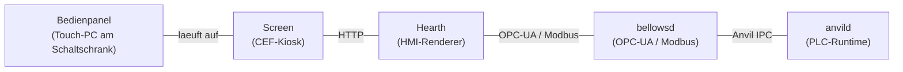



## Der Kiosk-Browser

**Screen** ist der industrielle Bedienpanel-Browser von ForgeIEC.
Eine schlanke Anwendung die in der Schicht zwischen Hardware-
Display und Web-HMI sitzt: sie laeuft fullscreen, oeffnet eine
beliebige HTTP-HMI-URL (typisch `Hearth`, alternativ 3rd-party-
HMIs) und bietet gleichzeitig eine eingebaute Settings-UI fuer
die Geraete-Konfiguration (Netz, WireGuard, Zeitzone, Sprache).

Geschrieben in **Rust** mit dem **Chromium Embedded Framework
(CEF)** und **winit** als Window-Manager. Laeuft unter **X11**,
**Wayland** und **Windows** — auf Linux amd64 + arm64 und auf
Windows x64.

---

## Funktionsumfang

| Bereich | Was Screen tut |
|---|---|
| **CEF-Integration** | Voller Chromium-Browser als eingebettetes Fenster |
| **Fullscreen + Windowed** | Default: borderless fullscreen; `--windowed` fuer Test/Debug |
| **Kiosk-Mode** | `--kiosk <URL>` — keine Adresszeile, kein Tab-Switch, nur die HMI |
| **Settings-UI** | Integrierter Rocket-Webserver auf Port 8080 mit Tera-Templates |
| **D-Bus-Backend** | NetworkManager + timedated + localed via zbus |
| **Lokale Settings** | SQLite-Store fuer geraete-spezifische Konfiguration |
| **WireGuard** | Multi-Tunnel-VPN-Verwaltung ueber NetworkManager (Konfig-Import oder Schluessel-Generierung) |
| **80+ Sprachen** | i18n mit Project Fluent (inkl. RTL: Arabisch, Hebraeisch, Farsi, Urdu) |
| **DCP-Client** | HTTP/WebSocket-Client fuer externen Settings-Daemon |

---

## Typischer Einsatz

Sie haben ein Bedienpanel am Schaltschrank: Screen laeuft drauf
und ist reine Anzeige (Chromium-Kiosk). Die HMI rendert **Hearth**
als HTTP-UI, gespeist aus OPC-UA / Modbus von **bellowsd**, dessen
Live-Werte wiederum aus **anvild** stammen. Der Operator sieht nur
die Anwendung — **keine** Linux-Oberflaeche, **keine** versehentlich-
startbaren Browser-Funktionen.

---

## Bedien-Modi

| Modus | Wann? | Wie? |
|---|---|---|
| **Kiosk** | Produktiv-Panel an einer Anlage | `screen --kiosk https://hmi.local` — Fullscreen, kein Exit ueber UI |
| **Fullscreen** | Wie Kiosk, aber mit Adresszeile fuer Diagnose | `screen` (Default) |
| **Windowed** | Test, Entwicklung | `screen --windowed` |
| **Settings-Only** | Erst-Konfiguration ohne HMI | Screen oeffnet `http://localhost:8080` (eingebaute Settings-UI) |

---

## Settings-UI

Auf Port 8080 laeuft eine Tera-templated Web-UI mit:

- **Netzwerk** — DHCP / statische IP, mehrere Interfaces,
  VLAN-Tags
- **WireGuard** — bis zu N gleichzeitige Tunnel, Schluessel-
  Generierung oder Konfig-Import (`.conf`)
- **Zeitzone** — via `timedated` D-Bus, geo-Auswahl plus manuelle
  Eingabe
- **Sprache** — `localed` D-Bus, 80+ Sprachen via Project Fluent
- **HMI-URL** — welche URL nach dem Start geladen wird
- **Display** — Aufloesung, Orientation (Hochkant / Quer)

Die Settings sind in einer **lokalen SQLite-Datenbank** persistiert
— ueberlebt Reboots, ist per `automation-settings`-CLI
auslesbar fuer Backup / Provisioning.

---

## Technische Eckdaten

| Eigenschaft | Wert |
|---|---|
| **Sprache** | Rust |
| **Browser-Engine** | Chromium Embedded Framework (CEF) 146 |
| **Window-Manager** | winit |
| **Settings-Server** | Rocket + Tera |
| **D-Bus-Stack** | zbus (NetworkManager + timedated + localed) |
| **Datenbank** | SQLite |
| **i18n** | Project Fluent, 80+ Sprachen inkl. RTL |
| **Display-Server** | X11, Wayland, Windows (Win32) |
| **Plattformen** | Linux amd64 + arm64, Windows x64 |
| **Lizenz** | AGPL-3.0 |

---

## Source

| Repository | Link |
|---|---|
| **Forgejo** | `ssh://git@git.forgeiec.io/ForgeIEC/screen.git` (nicht oeffentlich einsehbar — Zugriff nach Freischaltung Ihres SSH-Public-Keys) |
| **APT** | `sudo apt install forgeiec-screen-wayland` |

---

**Screen — der industrielle Browser fuer das Bedienpanel.**

blacksmith@forgeiec.io

