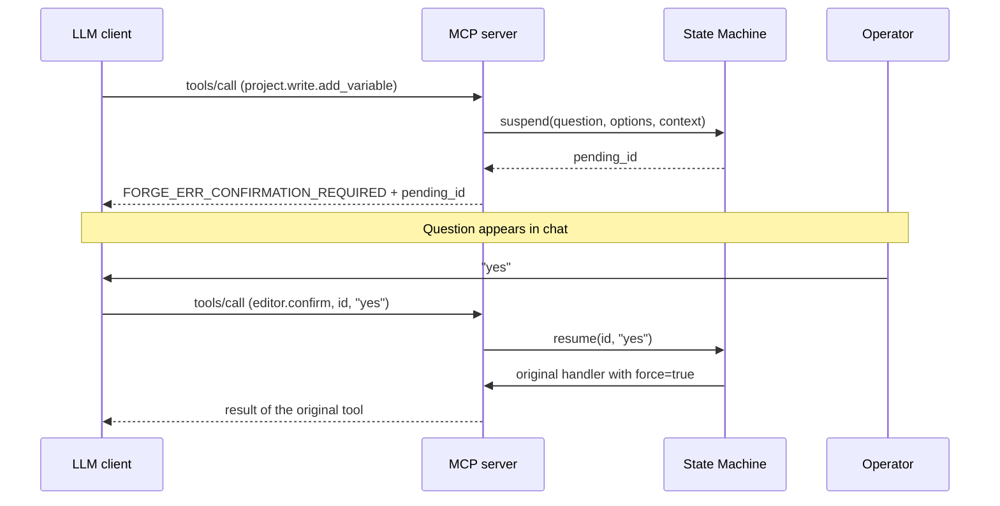

## Specification

Source document: `documentation/architecture/mcp-platform-v1.md` in
the source tree. Normative per RFC 2119 (`MUST` / `SHOULD` /
`MAY`). Version: `v1`. Size: ~2300 LOC.

The implementation references spec sections (e.g. `§7.4.2` for the
Caretaker model). Spec changes go through the same review process
as code.

---

## Protocol

| Field | Value |
|---|---|
| Protocol | Model Context Protocol (MCP) |
| Version | 2025-03-26 |
| Transport | HTTP + Server-Sent Events |
| Wire format | JSON-RPC 2.0 |
| Lifecycle | `initialize` → `tools/list` → `tools/call` |
| Capabilities | `tools.listChanged: true` |
| `notifications/tools/list_changed` | not implemented (backlog) |
| Conformance test | mcp-inspector |

---

## Transport security

### TLS

| Field | Value |
|---|---|
| Stack | Qt6 QSslSocket + system OpenSSL |
| Versions | TLS 1.3, 1.2 |
| Server cert | RSA-4096, SAN-bound, 10 years |
| Cert regeneration | on bind address change |
| SAN validation | RFC 6125 |
| Cipher suites | OpenSSL defaults (distribution-hardened) |
| Self-implemented crypto | none |

### mTLS (optional)

Active as soon as `~/.config/ForgeIEC/mcp/trust/*.pem` contains at
least one CA cert.

| Field | Value |
|---|---|
| peerVerifyMode | QueryPeer |
| Fallback without client cert | bearer auth |
| Chain validation | Qt SSL stack |
| Subject check | against peers.toml (own implementation) |

---

## Federation roster

### File layout

```toml
# peers.toml
[meta]
sequence_number = 17
signed_ts = "2026-05-12T18:00:00Z"
signed_by = "ForgeIEC-Team-CA"
ca_fingerprint_sha256 = "ba:fc:ef:..."
signature_b64 = "..."

[[peer]]
name = "alice@team"
fingerprint_sha256 = "ab:cd:..."
role = "author"
endpoint = "https://alice-ws.factory:7531"
```

Analogously `revoked.toml` for the revocation list.

### Signature

| Field | Value |
|---|---|
| Algorithm | Ed25519 (preferred) or RSA-PSS-SHA256 |
| Implementation | openssl pkeyutl shell-out |
| Signature payload | file without `signature_b64` line (line-oriented) |
| Replay protection | monotonic `sequence_number`, persisted in QSettings |
| Distribution channel | arbitrary (Git, S3, HTTP, USB) |

### Code path

`FMcpPeerRoster::verifySignature` (Studio),
`FMcpCaretaker::signCsr` for the signing inverse. Reload via
QFileSystemWatcher with 200 ms debounce.

---

## Confirmation State Machine

Source file: `FConfirmationStateMachine`. Spec: §9.5.

### Flow



### Properties

| Field | Value |
|---|---|
| Pending ID | UUIDv4 |
| Timeout | 5 min default, per-tool override |
| Bypass | only via `force=true`, set by the state machine itself |
| Audit | append-only JSONL in `~/.config/ForgeIEC/mcp_audit.log` |
| Read API | `editor.pending_confirmations` |

---

## Write access: three checks

### Check 1 — Build-time

```cmake
option(MCP_OVERRIDE_SECURITIES "Unlock MCP write tools" OFF)
```

Default OFF. Preprocessor-conditional — disabled code paths are
**not present** in the default binary. No runtime switch.

### Check 2 — State Machine

Every write tool goes through §9.5 (see above).

### Check 3 — Visibility

| Channel | Content |
|---|---|
| Chat log | every tool call visible |
| `~/.config/ForgeIEC/mcp_audit.log` | JSONL, append-only, timestamp + tool + args + choice |
| `initialize.instructions` | security override banner when the build-time flag is active |
| `warnings[]` in responses | override banner repeated |

---

## Force path

Force settings (pinning a value independent of the program) are
**not** accessible via MCP — no `force.*` tool, neither in default
nor override build.

### Defence layers

| Layer | Mechanism |
|---|---|
| 1 — codegen TOML | `-DFORCING_ENABLED` cmake option of the PLC runtime |
| 2 — anvild RPC | ForceVariable endpoint checks PLC build mode |
| 3 — Studio UI | F checkbox greyed out when PLC build has no force |
| 4 — MCP | no tool registered |

MCP read side: `monitor.snapshot` returns `forced=true|false` per
variable (Anvil gRPC `is_forced` field).

---

## Human identification

Source class: `FMcpFingerprintArt`. Spec: §7.6.

### Memorable ID

| Field | Value |
|---|---|
| Input | SHA-256 fingerprint (32 bytes) |
| Bit slice | first 44 bits, sliced into 4 × 11 bits |
| Wordlist | BIP-39 English (2048 entries) |
| Format | `word-word-word-word` |
| Bit-flip sensitivity (first 44 bits) | 4 of 4 words change |

### Randomart

| Field | Value |
|---|---|
| Algorithm | OpenSSH drunken bishop (`ssh-keygen -lv -E sha256`) |
| Grid | 17 × 9 |
| Augmentation string | `" .o+=*BOX@%&#/^SE"` |
| Markers | S = start, E = bishop end position |

### Surfaced in

| Endpoint | Content |
|---|---|
| `server_info.trust_store_cas[]` | per trust-store CA |
| `team.list_peers` | per peer |
| `team.request_cert` | for freshly issued cert |

---

## Caretaker model

Source class: `FMcpCaretaker`. Spec: §7.4.

### File layout

```
~/.config/ForgeIEC/mcp/ca-team/
  ca.key   RSA-4096, 600 permissions
  ca.crt   X.509, CA:TRUE, 10 years
                keyCertSign + cRLSign + digitalSignature
```

### Activation

| Requirement | Form |
|---|---|
| Build-time | `MCP_OVERRIDE_SECURITIES=ON` |
| Runtime flag | QSettings `mcp/caretaker_enabled` |
| Modal confirmation | literal "I accept Team-CA responsibility" |
| File presence | ca.key + ca.crt parse-valid |

`FMcpCaretaker::isCaretaker()` returns true only if all four are
satisfied.

### Operations

| Tool | Status |
|---|---|
| `team.list_peers` (Member + Caretaker) | done |
| `team.request_cert` (Caretaker) | done |
| `team.revoke_peer` (Caretaker) | stub (revoked.toml mutation in backlog) |
| `team.rotate_cert` (Member) | backlog |
| `team.export_setup` (Caretaker) | backlog |

All mutations through the state machine.

### Multi-Caretaker (HA)

Multiple Caretakers possible. Conflict resolution via monotonic
`sequence_number` in the signed roster.

---

## Audit + reproducibility

| Aspect | Status |
|---|---|
| Audit log | append-only JSONL, no delete path |
| Audit fields | timestamp, tool, args, choice, called_by |
| Codegen determinism | byte-identical POUS.c per `.forge` |
| Test coverage | 117+ tests, IEC language + 132 library blocks + multi-task + persist + force |
| Jitter test | physical measurement against baseline |

---

## Implementation languages

### ForgeIEC Studio

C++17 + Qt6. RAII via QObject parent chain. Implicit-shared QObjects
for cross-thread snapshots. No global mutable state.

MCP-layer modules:

| Class | File |
|---|---|
| FMcpServer | editor/src/runtime/FMcpServer.cpp |
| FMcpCertManager | editor/src/runtime/FMcpCertManager.cpp |
| FMcpTrustStore | editor/src/runtime/FMcpTrustStore.cpp |
| FMcpPeerRoster | editor/src/runtime/FMcpPeerRoster.cpp |
| FMcpCaretaker | editor/src/runtime/FMcpCaretaker.cpp |
| FMcpFingerprintArt | editor/src/runtime/FMcpFingerprintArt.cpp |
| FConfirmationStateMachine | editor/src/runtime/FConfirmationStateMachine.cpp |
| FMcpAuditLog | editor/src/runtime/FMcpAuditLog.cpp |

### Runtime server

`anvild`: Rust + Tokio + tonic. Memory-safe by borrow checker.
gRPC proto: `anvil-server/proto/plc_service.proto`.

### IPC

Anvil (Rust + C-FFI). ABI probe against type-hash drift:
`anvil-shared@50cb29f`. Three defence layers against mismatched
versions.

---

## Standards

| Standard | Use |
|---|---|
| IEC 61131-3 | Programming language + compile path (matiec) |
| PLCopen XML | Project file format |
| RFC 6125 | TLS server cert SAN validation |
| RFC 8032 (Ed25519) | Roster signature (preferred) |
| RFC 8017 (RSA-PSS) | Roster signature (HW token interop) |
| BIP-39 (English) | Memorable-ID wordlist |
| SSH ssh-keygen | Randomart algorithm |
| MCP 2025-03-26 | Protocol |
| JSON-RPC 2.0 | Wire format |
| RFC 2119 | Spec normative language |
| TOML 1.0 | Configuration |

---

## Open items (as of 2026-05-12)

| Item | Status |
|---|---|
| `team.revoke_peer` full implementation | stub |
| `team.rotate_cert` | backlog |
| `team.export_setup` | backlog |
| OCSP / CRL handling | not implemented |
| Memorable-ID typing confirmation (§7.4.2) | currently yes/cancel |
| `notifications/tools/list_changed` SSE | not emitted |
| Hardware token (PKCS#11 / FIDO2) for CA key | roadmap |
| `force.*` tool family | Phase-3 backlog |
| Bulk mode (MCP-10) | backlog |
| Caretaker toggle UI in Preferences | backlog |

Full list: `project_open_backlog.md` (internal).

---

## License

AGPL-3.0-or-later for all subprojects. Source inspectable.
Reproducible build via CPack — signed APT repository for
Debian/Ubuntu, signed RPM repository for AlmaLinux 9 and Fedora 44.

---

## Contact

Security reports + audit inquiries: blacksmith@forgeiec.io —
responsible disclosure preferred.

---

## Next

- [Security model (user view)](/help/ai/security/)
- [Team mode](/help/ai/team/)
- [MCP protocol for application engineers](/help/mcp/programmers/)
- [MCP for IT operations](/help/mcp/it/)
- [Back to the AI overview](/help/ai/)
