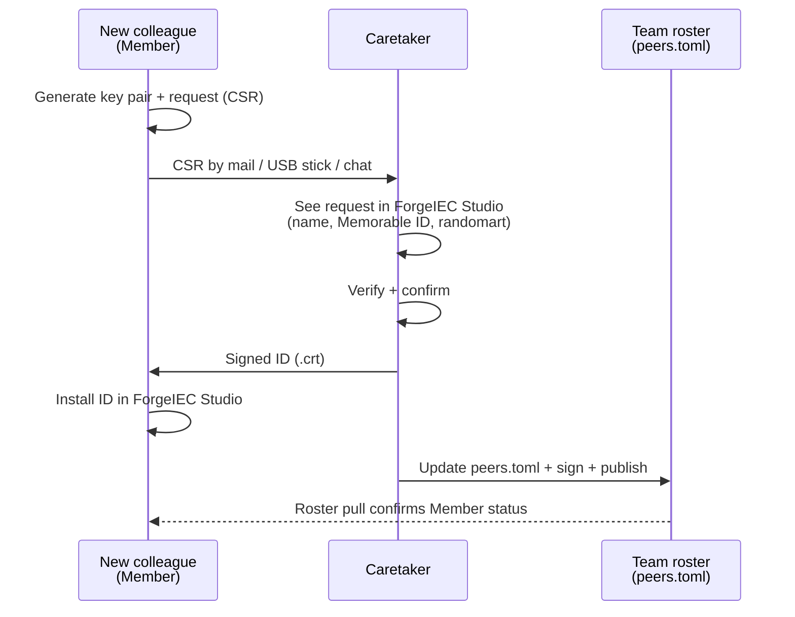

## What do I need this for?

Imagine: two programmers sit at different workstations and develop
the same plant project. Each has their own AI assistant. It would
be useful if:

- The AI assistant on workstation A **could see the POUs on
  workstation B**.
- Workstation B could **request a code review from workstation A's
  AI**.
- A central machine (e.g. a build server) could **pre-compile** the
  code before it goes to the real PLC.

We call this a **team**. For it to work, **trust** between the
machines is needed — no random outside editor should be able to
reach yours, only colleagues of your choice.

---

## How does trust work?

ForgeIEC uses the same principle web browsers do: **digital IDs**
(certificates). Every workstation has an ID, and only IDs issued by
a **common trusted authority** are accepted.

We call that trusted authority the **Caretaker** — a designated
workstation in your team that issues and revokes IDs. The
"gatekeeper", essentially.

Three roles in the team:

| Role | What it does |
|---|---|
| **Caretaker** | Issues IDs, revokes them. One workstation in your team — typically the team lead's or a central build machine. |
| **Member** | Normal workstations — get their ID from the Caretaker. Can send requests to other members. |
| **Guest (not in the team)** | Refused — your editor doesn't even see them. |

---

## How do I recognise an ID?

A certificate fingerprint is a 64-character hex number:

> `ba:fc:ef:32:9d:5c:36:08:63:c5:47:d5:9f:c2:8b:92:...`

Comparing this byte by byte is not practical. ForgeIEC therefore
gives you **two additional representations** of the same
fingerprint:

### Memorable ID

Four English words, uniquely associated with each fingerprint:

> `road-trash-smile-deny`

This is **verbally verifiable** ("Tell me your workstation's
Memorable ID over the phone"). Even a single bit change at the
beginning of the fingerprint shifts **all four words** — forgeries
are immediately obvious.

### Picture (randomart)

A small ASCII image, unique per fingerprint:

```
+----[SHA256]-----+
|        o. ..... |
|       o .o .   .|
|      o  ....   o|
|.    . .+.   o ..|
| + .. ..Soo.. o  |
|. +. . . +.++.   |
| oo   o .oo+..   |
|...= o +o.+      |
|E+*o. +.o=o      |
+-----------------+
```

You learn the **shape** of your colleagues' pictures after 2-3
encounters. A changed fingerprint **looks visibly different**.

> **In practice:** when admitting a new colleague to the team, the
> Caretaker shows you both side by side — name + picture. You
> confirm if both fit the person currently joining. Like a
> **digital ID check**.

---

## A new colleague is admitted to the team



Here is the flow — from your perspective as the operator:

**1. The new colleague prepares an ID request.**
Their ForgeIEC Studio generates a key pair and a request (CSR). They send
the request to you (Caretaker) by mail / USB stick / chat.

**2. As Caretaker, you see the request in your editor.**
Your editor shows:
- Subject (`alice@MyTeam`)
- Memorable ID of the **not-yet-issued** cert
- Randomart of it

**3. You confirm** if the details match — the Caretaker issues the
ID and sends it back to the colleague.

**4. The colleague installs the ID** in their editor and is from
then on a Member.

**5. You publish the updated `peers.toml`** — the file in which
all team members are listed with their ID fingerprints.
Distribution by Git, shared drive, USB, shared SharePoint —
whatever, because the file is **digitally signed**. A copy
modified in transit is **refused** by ForgeIEC Studio.

---

## Removing a colleague from the team

When a colleague leaves, loses a laptop, or an ID is compromised:

1. You as Caretaker **revoke** the ID — ForgeIEC Studio adds it
   to a `revoked.toml` list, signs the list, publishes it.
2. All other team members pull the list every few minutes and
   from then on **immediately** reject the revoked ID.

**Note (as of 2026-05):** the actual writing of the `revoked.toml`
list is the last open sub-task — until then you do it manually:

- Stop ForgeIEC Studio
- Edit `revoked.toml`, append a new line with the fingerprint +
  reason, increment `sequence_number` by 1
- Re-sign with the Caretaker key (the command will be added in
  later docs once the tool is ready)

Once `team.revoke_peer` is available in ForgeIEC Studio, this
runs fully through the UI.

---

## Prerequisites for team mode

- Both editors are **unlocked** (see
  [Security model](/help/ai/security/))
- One workstation is configured as **Caretaker**. In the
  Preferences there is an extra step for this — you must type the
  exact phrase **"I accept Team-CA responsibility"** before
  Caretaker mode is on. That is on purpose: a Caretaker holds the
  trust chain of the whole team in their hands.
- Both workstations can **reach each other over the network**
  (open port, firewall rule — the addresses live in `peers.toml`).

---

## Next

- [Security model](/help/ai/security/) — what does "unlocked" mean
- [Personas](/help/ai/agents/) — who may do what in the team
- [Back to the AI overview](/help/ai/)
