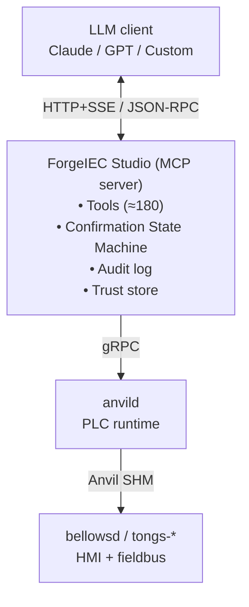

## What is MCP?

**MCP** stands for **Model Context Protocol**. It is an **open,
vendor-neutral protocol** published by Anthropic in early 2025. Its
goal: let LLMs (Claude, ChatGPT, others) talk to tools such as
editors, databases, or browser automations in a **uniform,
well-specified language** — instead of writing a custom integration
each time.

ForgeIEC implements the **server side** of MCP — ForgeIEC Studio
**is** an MCP server. Any MCP-compatible client can connect — the
most important options:

- **The built-in chat tab in ForgeIEC Studio** itself (default, no
  setup)
- **Anthropic Claude Desktop** (Mac, Windows, Linux) —
  `~/Library/Application Support/Claude/claude_desktop_config.json`
  or the equivalent under `~/.config/Claude/`; enter URL +
  bearer token from ForgeIEC Studio there
- **VS Code** with an **MCP extension** (e.g. Anthropic's "MCP") —
  register the ForgeIEC MCP server in the extension settings as
  an external MCP endpoint; then you can call ForgeIEC tools from
  VS Code chat sessions
- **Claude Code (CLI)** — `claude mcp add forgeiec
  https://forgeiec-ws.local:7531 --token <bearer>`
- **ChatGPT (OpenAI)** with MCP connector
- **Custom clients** you write yourself (see next section)
- **mcp-inspector** (the official debug tool, npm)

In all cases you need two pieces from ForgeIEC Studio: the
**server URL** (`https://<hostname>:7531`) and the **bearer
token** from `Preferences → AI → Profile → Bearer Token`. With
those, your external client can execute exactly the same MCP
tools as the built-in chat tab.

---

## Who is this section for?

Depending on your role, two entry points:

### [For application engineers](/help/mcp/programmers/)

If you want to call the MCP server of ForgeIEC Studio from your own
scripts or tools. Topics:

- How the call sequence works (lifecycle)
- Authentication via bearer token or client certificate
- Reading the tool list
- Examples with `curl`
- Handling confirmation prompts
- Plug-in API status

### [For IT + operations](/help/mcp/it/)

If you deploy, monitor, or integrate ForgeIEC into an existing IT
landscape. Topics:

- Network: ports, firewall rules, bind address
- Certificates: server cert, trust store, renewal
- Identities + tokens: bearer per profile
- Log files: location, format, rotation
- Backup: what to save, what is regeneratable
- Monitoring: server_info as a health check for your monitoring
- Troubleshooting: common problems + recipes

---

## Architecture picture

The MCP server is **embedded in the ForgeIEC Studio process** — it
shares memory and lifecycle with the running project. Tool calls
are therefore very fast (no RPC hop), and the client always sees
the **current in-memory state**, not a stale file mirror.

---

## Spec references

For deeper details:

- **MCP protocol** (official): `https://modelcontextprotocol.io`
- **MCP inspector** (debug tool, npm):
  `https://github.com/modelcontextprotocol/inspector`
- **ForgeIEC's own MCP spec**: in the source tree at
  `documentation/architecture/mcp-platform-v1.md` — RFC-2119
  normative, approx. 2300 LOC, covers all security and federation
  decisions

---

## Next

- [For application engineers](/help/mcp/programmers/)
- [For IT + operations](/help/mcp/it/)
- [User-facing AI overview](/help/ai/)
- [Architecture deep-dive](/help/ai/architecture/)
