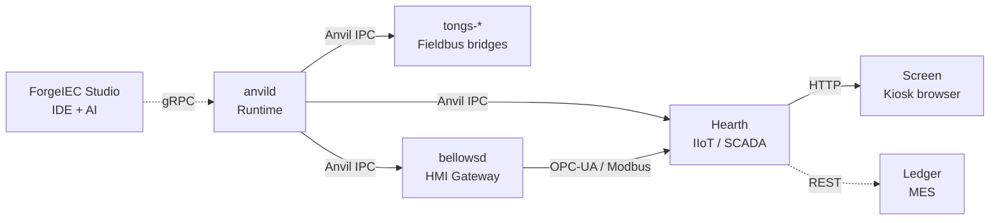

## What the platform delivers

ForgeIEC is a complete platform for industrial automation — from
programming to control system. Every component carries the name
of a blacksmith's tool and has a clearly defined remit. Components
are standalone daemons or applications, jointly running over
zero-copy IPC and gRPC.

| | Component | Remit | Status |
|:---:|---|---|---|
|    | **ForgeIEC Studio** | IEC 61131-3 IDE + bus config + AI assistant | productive |
|    | **anvild**          | PLC runtime + Anvil zero-copy IPC between subsystems | productive |
|  | **bellowsd**        | OPC-UA / HMI gateway | in progress |
|     | **tongs-***         | Fieldbus bridges (Modbus / EtherCAT / Profibus / EthernetIP) | mixed |
|    | **Screen**          | Industrial kiosk browser (HMI panel) | productive |
|    | **Hearth**          | IIoT subscriber / SCADA layer | planned |
|    | **Ledger**          | Order management / MES integration | planned |

---

## The components

### 🛠️ ForgeIEC Studio — the workbench



Native C++/Qt6 IDE on the workstation. All five IEC languages
(ST + IL + FBD + LD + SFC), bus configuration, live monitor,
oscilloscope, AI assistant built in. Tree-sitter syntax, gRPC link
to anvild, MCP server for LLM tooling.

[Learn more](forge-studio/)

### 🔥 anvild — the runtime + Anvil IPC



Rust/Tokio daemon on the target PLC. Multi-task scheduler with
pthread parallelism, deterministic scan cycles, gRPC listener for
Studio, subprocess manager for the bus bridges. Stale-SHM auto-
cleanup at startup.

Built in is **Anvil** — the zero-copy shared-memory layer between
runtime, bridges and external subscribers. Based on iceoryx2 with
ABI probe against type-hash drift. Wire protocol for status, I/O,
diagnostics.

[Learn more](anvil/)

### 🌬️ bellowsd — the bellows



OPC-UA server + Modbus TCP server for HMI integration. Exports
pool variables with the `bellows_export` flag as OPC-UA nodes +
Modbus coils. Gated individually per variable.

[Learn more](bellows/)

### 🔧 tongs-* — the fieldbus tongs



One daemon per protocol. Uniform fault model
(`OK/WARN/FAULT/OFFLINE/UNKNOWN`), FDD-driven diagnostic bits,
Anvil zero-copy IPC to the runtime. Modbus TCP productive,
EtherCAT in progress, Profibus + EtherNet/IP planned.

[Learn more](tongs/)

### 🖥️ Screen — the kiosk browser



CEF-based industrial kiosk browser (Chromium Embedded Framework
+ Rust + winit). Runs fullscreen on HMI panels, opens any web HMI
(Bellows / Hearth / 3rd-party). Integrated Rocket web server for
settings (network, WireGuard, time zone, 80+ languages), D-Bus
backend for NetworkManager / timedated / localed.

[Learn more](screen/)

### 🏠 Hearth — the forge hearth



IIoT subscriber + SCADA layer. Plans: subscribe to Anvil topics,
time-series-DB integration (InfluxDB, TimescaleDB), Mosquitto MQTT
bridge, alarm management, Grafana dashboards. Planned —
architecture spec in preparation.

[Learn more](hearth/)

### 📒 Ledger — the order book



Order management + MES integration. Plans: production orders,
piece-count tracking, traceability (material → batch → product),
shift log, bridge to ERP systems. Planned — comes after Hearth.

[Learn more](ledger/)

---

## How the components fit together

Studio lives on the workstation, everything else on the target
systems. Workstations + target systems can be linked together via
the [team federation model](/news/federation-team-trust/) — multiple
workstations see their machines.

---

## Open source + standing on predecessors

All components are **AGPL-3.0**. Source visible on GitHub +
Forgejo. Build reproducible via Debian CPack + signed APT
repository.

ForgeIEC stands on the shoulders of **OpenPLC** (Thiago Alves,
since 2018) and keeps file compatibility with OpenPLC projects.
Read the [founding story](/news/die-forgeiec-geschichte/) for the
full path from OpenPLC fork to standalone platform.

---

**The tools of the forge. Open by default.**

blacksmith@forgeiec.io

