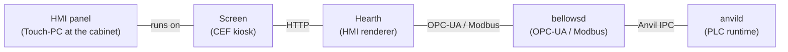



## The kiosk browser

**Screen** is the industrial HMI-panel browser of ForgeIEC. A lean
application that sits between the hardware display and the web HMI:
it runs fullscreen, opens any HTTP HMI URL (typically `Hearth`,
alternatively 3rd-party HMIs) and at the same time offers a
built-in settings UI for device configuration (network, WireGuard,
time zone, language).

Written in **Rust** with the **Chromium Embedded Framework (CEF)**
and **winit** as window manager. Runs on **X11**, **Wayland** and
**Windows** — on Linux amd64 + arm64 and on Windows x64.

---

## What Screen does

| Area | What Screen does |
|---|---|
| **CEF integration** | Full Chromium browser as an embedded window |
| **Fullscreen + windowed** | Default: borderless fullscreen; `--windowed` for test/debug |
| **Kiosk mode** | `--kiosk <URL>` — no address bar, no tab switch, just the HMI |
| **Settings UI** | Integrated Rocket web server on port 8080 with Tera templates |
| **D-Bus backend** | NetworkManager + timedated + localed via zbus |
| **Local settings** | SQLite store for device-specific configuration |
| **WireGuard** | Multi-tunnel VPN management via NetworkManager (config import or key generation) |
| **80+ languages** | i18n with Project Fluent (incl. RTL: Arabic, Hebrew, Persian, Urdu) |
| **DCP client** | HTTP/WebSocket client for an external settings daemon |

---

## Typical deployment

You have an HMI panel at the cabinet: Screen runs on it and is
pure display (Chromium kiosk). The HMI is rendered by **Hearth**
as an HTTP UI, fed via OPC-UA / Modbus from **bellowsd**, whose
live values in turn come from **anvild**. The operator sees only
the application — **no** Linux desktop, **no** accidentally-
startable browser functions.

---

## Operation modes

| Mode | When? | How? |
|---|---|---|
| **Kiosk** | Productive panel at a machine | `screen --kiosk https://hmi.local` — fullscreen, no exit through UI |
| **Fullscreen** | Like kiosk but with address bar for diagnostics | `screen` (default) |
| **Windowed** | Test, development | `screen --windowed` |
| **Settings only** | First-time setup without HMI | Screen opens `http://localhost:8080` (built-in settings UI) |

---

## Settings UI

A Tera-templated web UI runs on port 8080 with:

- **Network** — DHCP / static IP, multiple interfaces, VLAN tags
- **WireGuard** — up to N simultaneous tunnels, key generation or
  config import (`.conf`)
- **Time zone** — via `timedated` D-Bus, geo selection plus manual
  entry
- **Language** — `localed` D-Bus, 80+ languages via Project Fluent
- **HMI URL** — which URL is loaded after startup
- **Display** — resolution, orientation (portrait / landscape)

Settings are persisted in a **local SQLite database** — survives
reboots, readable via the `automation-settings` CLI for backup /
provisioning.

---

## Technical specs

| Aspect | Value |
|---|---|
| **Language** | Rust |
| **Browser engine** | Chromium Embedded Framework (CEF) 146 |
| **Window manager** | winit |
| **Settings server** | Rocket + Tera |
| **D-Bus stack** | zbus (NetworkManager + timedated + localed) |
| **Database** | SQLite |
| **i18n** | Project Fluent, 80+ languages incl. RTL |
| **Display servers** | X11, Wayland, Windows (Win32) |
| **Platforms** | Linux amd64 + arm64, Windows x64 |
| **License** | AGPL-3.0 |

---

## Source

| Repository | Link |
|---|---|
| **GitHub** | [github.com/Beerlesklopfer/screen](https://github.com/Beerlesklopfer/screen)  |
| **Forgejo** | [git.forgeiec.io/ForgeIEC/screen](https://git.forgeiec.io/ForgeIEC/screen) |
| **APT** | `sudo apt install forgeiec-screen` |

---

**Screen — the industrial browser for the HMI panel.**

blacksmith@forgeiec.io

